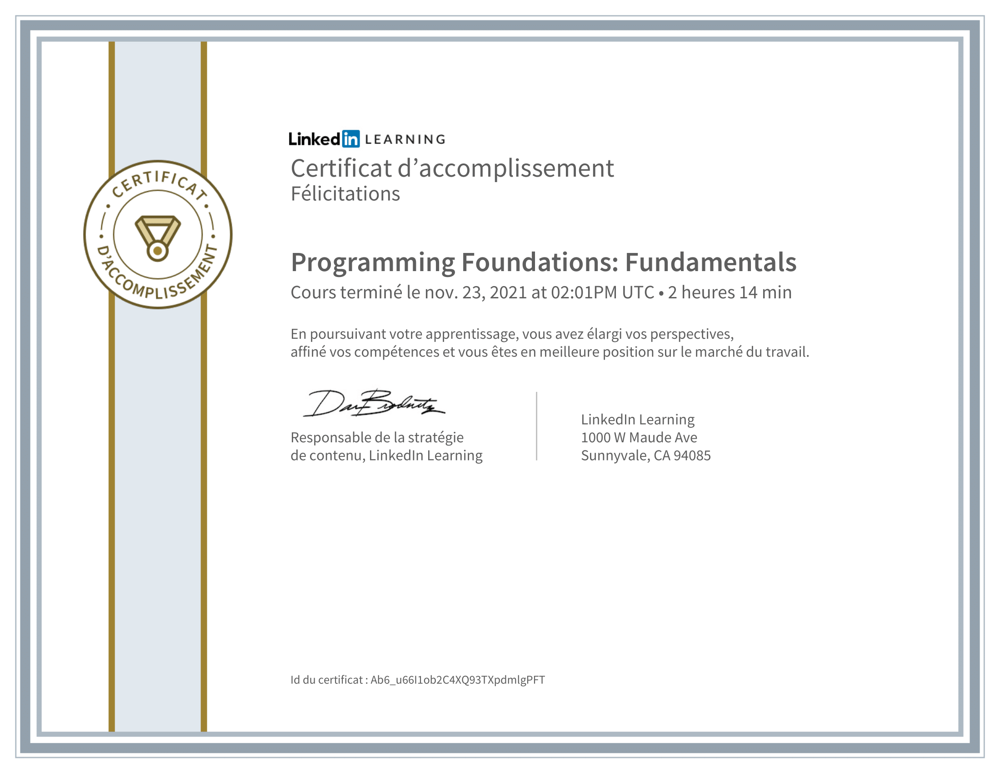

# Programming-foundation-Fundamentals

### Code Summary and Explanation

- [**Section 1:** Programming Basics](./Course_Code_&_Explanation/1-programming-Basics/)
- [**Section 2:** Programming Syntax](./Course_Code_&_Explanation/2-programming-syntax/)
- [**Section 3:** Variable And DataTypes ](./Course_Code_&_Explanation/3-variable-and-dataTypes/)
- [**Section 4:** Conditional Code](./Course_Code_&_Explanation/4-conditional_code/)
- [**Section 5:** Modular Code ](./Course_Code_&_Explanation/5-Modular_code/)

---

### [challenges](./Challenges/)

---

### Course details

- Gain the core knowledge to begin programming in any language. In this course, instructor Annyce Davis uses Python to explore the core concepts and structure of programming languages and helps you grasp what’s going on under the hood. After going over basic statements and expressions in Python, Annyce explores strings, variables, and conditional code which are common topics in all programming languages. She also shows how to work with different kinds of data and troubleshoot a variety of errors. Along the way, she compares how code is written in several different languages and provides guidance on the criteria to use when choosing a programming language. Upon wrapping up this course, you’ll have the knowledge you need to continue your coding journey in whichever language piques your interest.

---

### Learning objectives

- Writing source code
- Basic statements and expressions
- Working with numbers and strings
- Writing conditional code
- Increasing your efficiency with functions
- Working with comments
- Making decisions in code

---

### Learning objectives

- Writing source code
- Basic statements and expressions
- Working with numbers and strings
- Writing conditional code
- Increasing your efficiency with functions
- Working with comments
- Making decisions in code
- Troubleshooting errors
- Learning about other languages

---

 [Course Link](https://www.linkedin.com/learning/programming-foundations-fundamentals-3/)

## [Next Course](../-02-Programming-Foundations-Beyond-Fundamentals/)

### [Back To LinkedIn Courses](../)

**Made with 💛 by @SABER_Mohamed**
