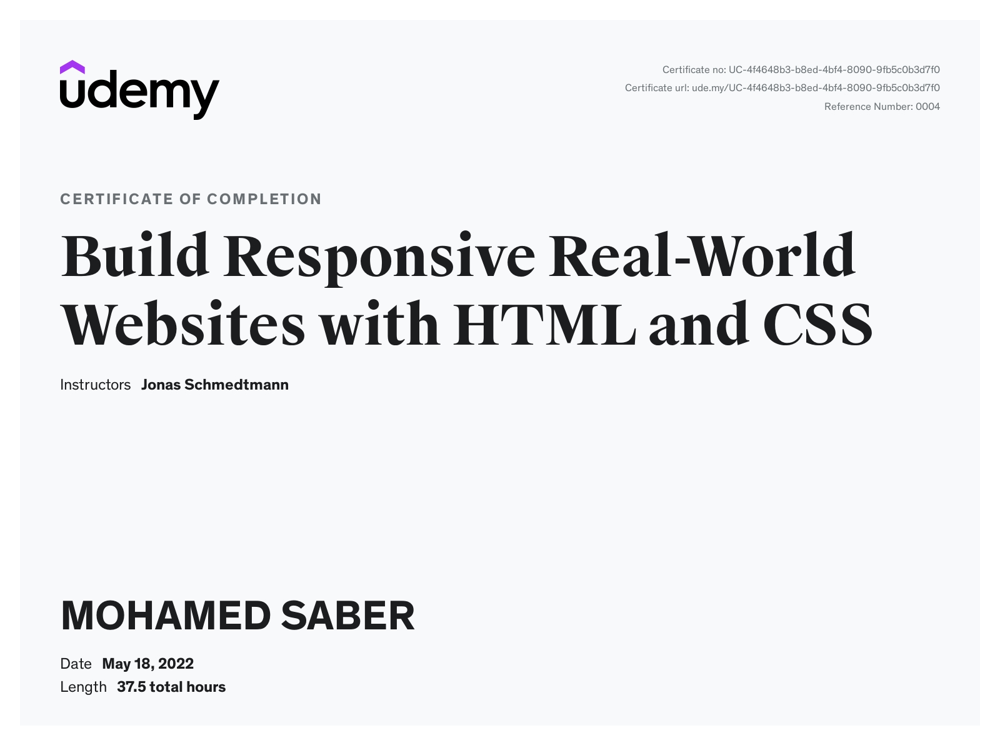

# Build Responsive Real-World Websites with HTML and CSS
## Challenges
- [x] [Section 2 – Challenge #2](./Challenges/01-Challenge/)
- [x] [Section 3 – Challenge #1](./Challenges/02-Challenge/)
- [x] [Section 3 – Challenge #2](./Challenges/03-Challenge/)
- [x] [Section 3 – Challenge #3](./Challenges/04-Challenge/)
- [x] [Section 4 – Challenge #1](./Challenges/05-Challenge/)
- [x] [Section 4 – Challenge #2](./Challenges/06-Challenge/)
- [x] [Section 4 – Challenge #3](./Challenges/07-Challenge/)

---
## Projects
### Omnifood
- [Project-code](./Projects/Omnifood)  
- [Live Demo](0mnif00d.netlify.app)
---
## Code
- [Code](./Projects/Omnifood)
---
[Course-Link](https://www.udemy.com/course/design-and-develop-a-killer-website-with-html5-and-css3) 

 
