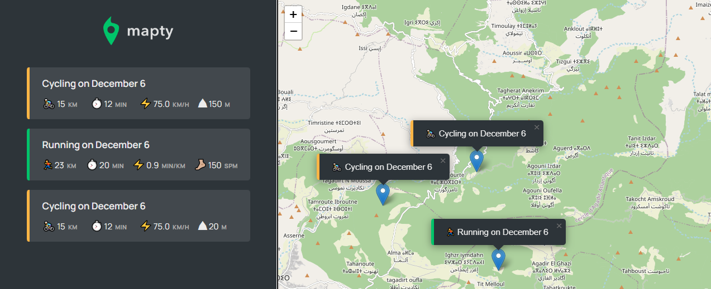

# mapApp
Map application Using pure JavaScript &amp; Leaflet API.

> #### In this app, you can log your running or cycling workouts with location, distance, time, pace, and steps/minute. You can also see all your workouts at a glance and on a map.

## Live Demo

> ### [Live Demo Link](https://sbsport.netlify.app)
## Built with
- HTML
- CSS
- JavaScript (OOP)

### for now \*not mobile friendly

## Additional Used

- Geolocation Api
- LocalStorage Api
- Leaflet map
- Google Fonts