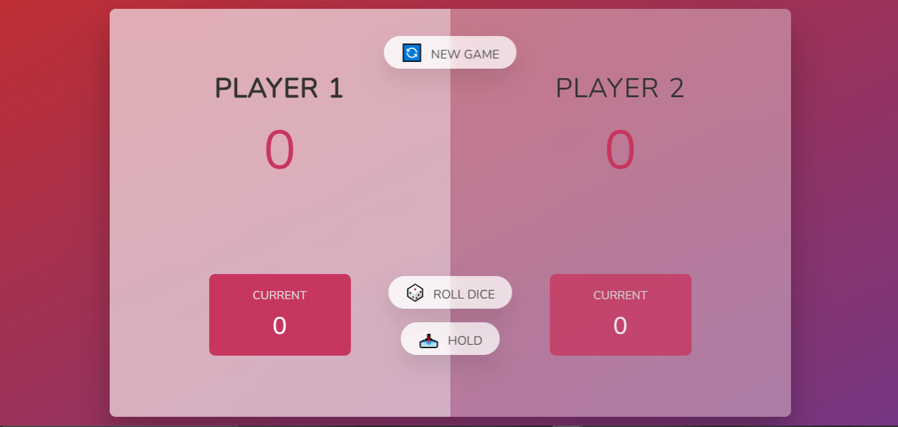

# :game_die: JS-DOM => GAME :game_die:
---

 :memo: Your mission is to make a game using the DOM.
 you have the right to use :

  * [x] HTML :beer:
  * [x] CSS :beer:
  * [x] JS :beers:

####  :confetti_ball: RULES :confetti_ball::

* The game has 2 players, each taking their turn
* Each turn, a player rolls a dice as many times as they wish. Each result is added to its `ROUND` score.
* BUT, if the player rolls the dice and rolls a 1, his `ROUND` score is lost. After that, it's the next player's turn
* The player can choose 'Hold', which means that his `ROUND` is added to the `GLOBAL` score. After that, it's the next player's turn.
* The first player to reach 20 points on `GLOBAL` wins the game.
---
* [ ]:bangbang: Your Code will be structured :file_folder:
* [x] Doing TDD is not mandatory.:warning:
* [x] The game must be available on a github-pages :rocket:
* [x] resources will be available (Les images)
---

### DEVELOPER : MOHAMED SABER
> 'GOOD LUCK'
