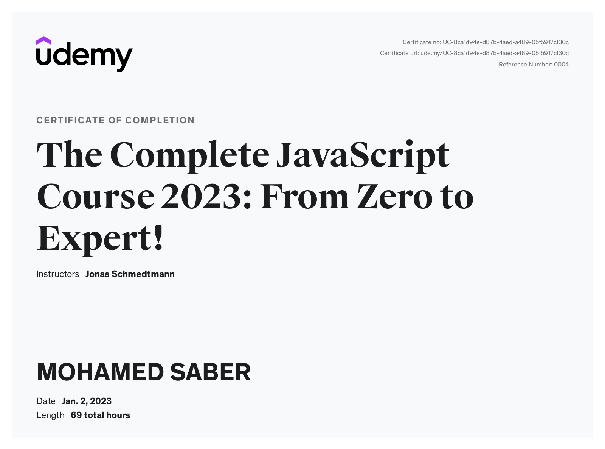

# The Complete JavaScript Course 2022: From Zero to Expert!
## Projects
### Pig Game 🦄
- [Project-code](./Projects/Pig-Game)
- [Live Demo]()
### Bankist 🏟
- [Project-code](./Projects/Bankist)
- [Live Demo](https://bankkkk.netlify.app)
### Bankist Site 💰
- [Project-code](./Projects/Bankist-Site)
- [Live Demo](https://bankaa.netlify.app)
### Mapty 🗺
- [Project-code](./Projects/Mapty)
- [Live Demo](https://dosomesport.netlify.app)
### Guess My Number 🎰
- [Project-code](./Projects/Guess-My-Number)
- [Live Demo](https://saber-game-2.netlify.app)
### OmniFood 🍕
- [Project-code](./Projects/Omnifood)
- [Live Demo](https://0mnif00d.netlify.app)
### Forkify 🍕
- [Project-code](https://github.com/SABER-MOHAMED/Forkify)
- [Live Demo](https://saber-recipes.netlify.app)
---
[Course-Link](https://www.udemy.com/course/the-complete-javascript-course/) 

